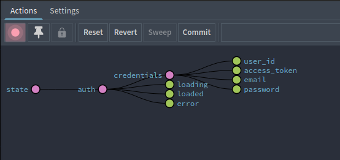
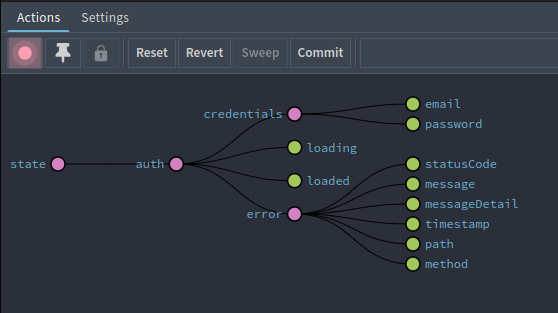
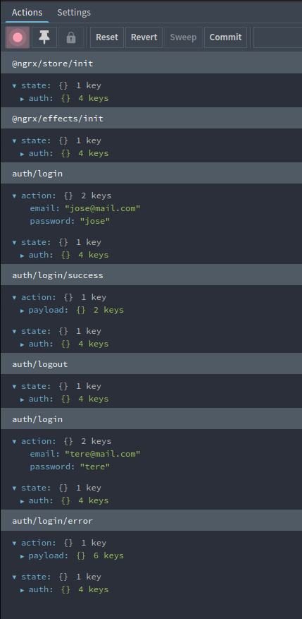
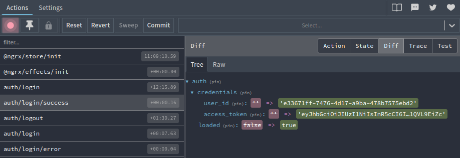

# PEC2
## Ejercicio 1
Todo ok

## Ejercicio 2
He cambiado la longitud de la contraseña a 4 en el login porque tenía usuarios creados con esa longitud.

Dentro del pipe de las llamadas a los servicios no sería necesario el catchError pero se podrían controlar los errores que no fueran HttpErrorResponse

    catchError((err: any) => {
        if (!(err instanceof HttpErrorResponse)) {
            console.error("Uncontrolled error", err);
        }
        return throwError(err);
    })

Todo ok

### Capturas de pantalla REDUX

- Inicio de sessión satisfactorio

- Inicio de sessión erróneo

- Monitor del inicio de sessión

- Inspector del inicio de sessión

